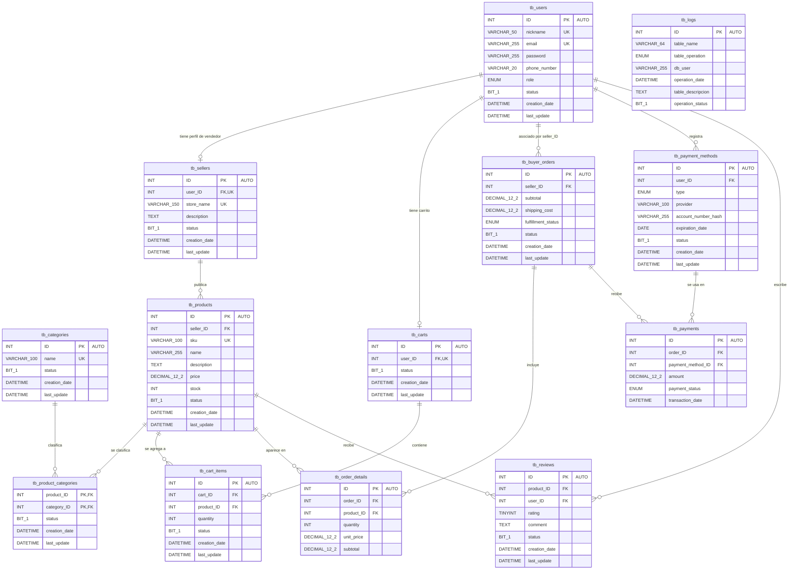

# Diccionario de base de datos

Base de datos: `db_test_7b`

```mermaid
erDiagram
    tb_users {
        INT ID PK "AUTO"
        VARCHAR_50 nickname UK
        VARCHAR_255 email UK
        VARCHAR_255 password
        VARCHAR_20 phone_number
        ENUM role
        BIT_1 status
        DATETIME creation_date
        DATETIME last_update
    }
    tb_sellers {
        INT ID PK "AUTO"
        INT user_ID FK,UK
        VARCHAR_150 store_name UK
        TEXT description
        BIT_1 status
        DATETIME creation_date
        DATETIME last_update
    }
    tb_categories {
        INT ID PK "AUTO"
        VARCHAR_100 name UK
        BIT_1 status
        DATETIME creation_date
        DATETIME last_update
    }
    tb_products {
        INT ID PK "AUTO"
        INT seller_ID FK
        VARCHAR_100 sku UK
        VARCHAR_255 name
        TEXT description
        DECIMAL_12_2 price
        INT stock
        BIT_1 status
        DATETIME creation_date
        DATETIME last_update
    }
    tb_product_categories {
        INT product_ID PK,FK
        INT category_ID PK,FK
        BIT_1 status
        DATETIME creation_date
        DATETIME last_update
    }
    tb_carts {
        INT ID PK "AUTO"
        INT user_ID FK,UK
        BIT_1 status
        DATETIME creation_date
        DATETIME last_update
    }
    tb_cart_items {
        INT ID PK "AUTO"
        INT cart_ID FK
        INT product_ID FK
        INT quantity
        BIT_1 status
        DATETIME creation_date
        DATETIME last_update
    }
    tb_buyer_orders {
        INT ID PK "AUTO"
        INT seller_ID FK
        DECIMAL_12_2 subtotal
        DECIMAL_12_2 shipping_cost
        ENUM fulfillment_status
        BIT_1 status
        DATETIME creation_date
        DATETIME last_update
    }
    tb_order_details {
        INT ID PK "AUTO"
        INT order_ID FK
        INT product_ID FK
        INT quantity
        DECIMAL_12_2 unit_price
        DECIMAL_12_2 subtotal
    }
    tb_payment_methods {
        INT ID PK "AUTO"
        INT user_ID FK
        ENUM type
        VARCHAR_100 provider
        VARCHAR_255 account_number_hash
        DATE expiration_date
        BIT_1 status
        DATETIME creation_date
        DATETIME last_update
    }
    tb_payments {
        INT ID PK "AUTO"
        INT order_ID FK
        INT payment_method_ID FK
        DECIMAL_12_2 amount
        ENUM payment_status
        DATETIME transaction_date
    }
    tb_reviews {
        INT ID PK "AUTO"
        INT product_ID FK
        INT user_ID FK
        TINYINT rating
        TEXT comment
        BIT_1 status
        DATETIME creation_date
        DATETIME last_update
    }
    tb_logs {
        INT ID PK "AUTO"
        VARCHAR_64 table_name
        ENUM table_operation
        VARCHAR_255 db_user
        DATETIME operation_date
        TEXT table_descripcion
        BIT_1 operation_status
    }

    tb_users ||--o| tb_sellers : "tiene perfil de vendedor"
    tb_sellers ||--o{ tb_products : "publica"
    tb_products ||--o{ tb_product_categories : "se clasifica"
    tb_categories ||--o{ tb_product_categories : "clasifica"
    tb_users ||--o| tb_carts : "tiene carrito"
    tb_carts ||--o{ tb_cart_items : "contiene"
    tb_products ||--o{ tb_cart_items : "se agrega a"
    tb_users ||--o{ tb_buyer_orders : "asociado por seller_ID"
    tb_buyer_orders ||--o{ tb_order_details : "incluye"
    tb_products ||--o{ tb_order_details : "aparece en"
    tb_users ||--o{ tb_payment_methods : "registra"
    tb_buyer_orders ||--o{ tb_payments : "recibe"
    tb_payment_methods ||--o{ tb_payments : "se usa en"
    tb_products ||--o{ tb_reviews : "recibe"
    tb_users ||--o{ tb_reviews : "escribe"
```
